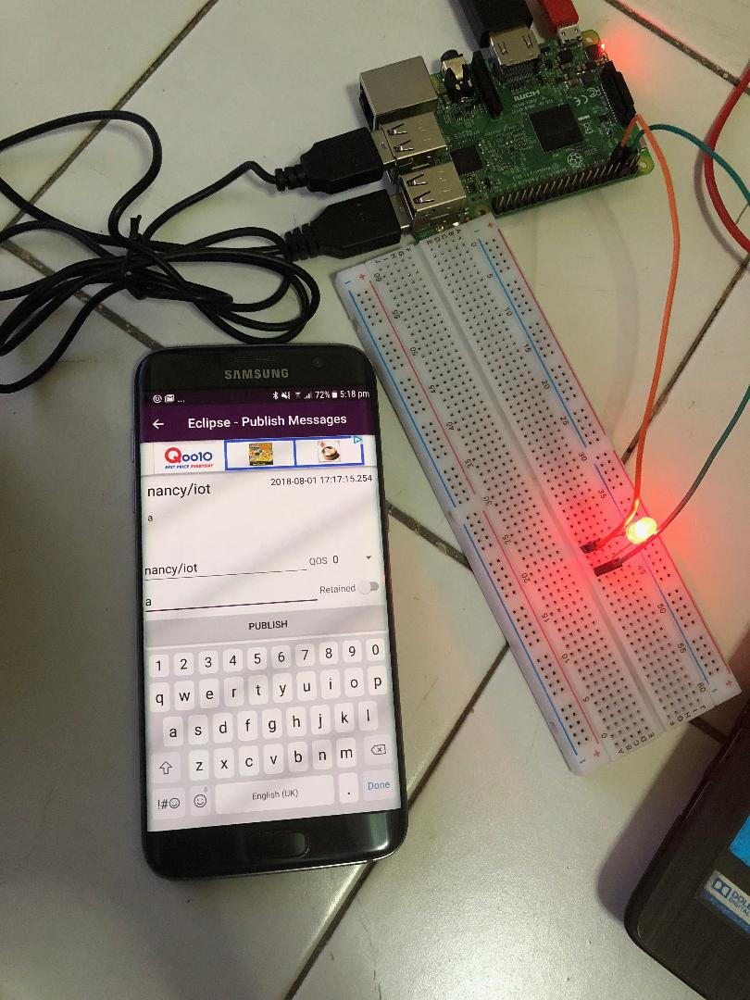

Raspberrypi3_MQTT_Smartphone_Control_LED
========================================

This Project relies on Controlling LED which is connected with Raspberry Pi 3
from Smartphone App – MQTT Client via MQTT protocol.

Requirements:

-   Raspberry Pi 3

-   Bread Board, Jumper Wires

-   LED

-   Android Mobile with App MQTT Client

Using Python programming, the coding is done. Here LED is connected to Pin
7(Board Numbering).

Publish Client : Smart Phone

MQTT Broker : iot.eclipse.org

Subscribe Client : Raspberry Pi

Topic : nancy/iot

